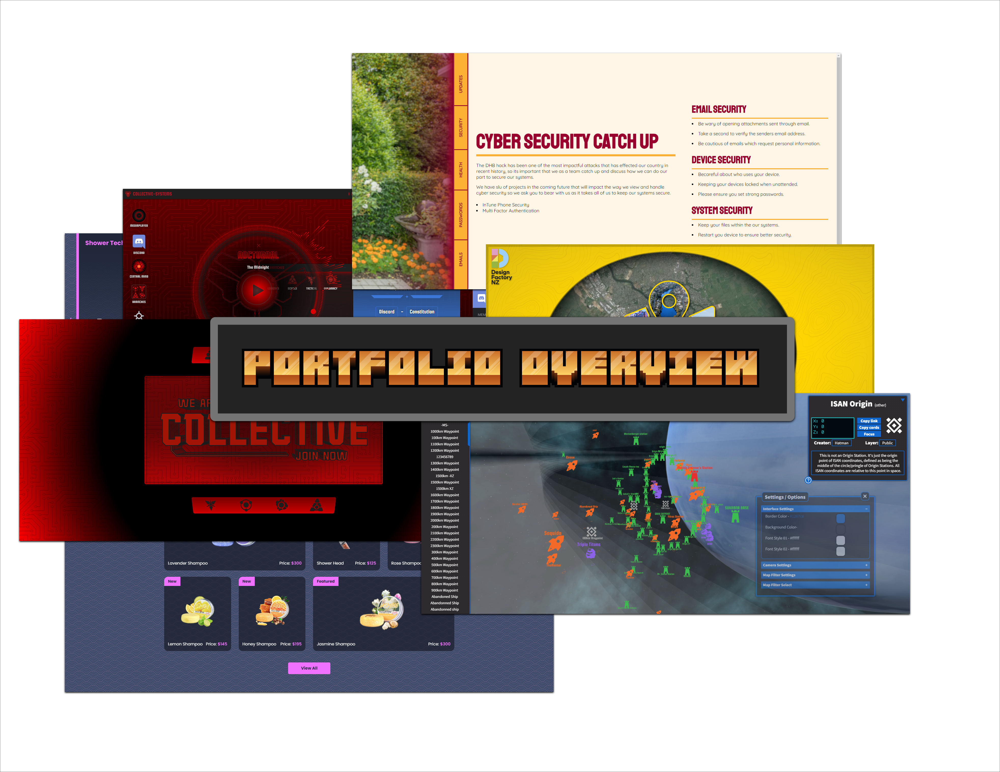

  

# Portfolio Overview

Repository containing thumbnails of as many of my projects as I could find.

### Downloading

Use the following url to download this project: 

`https://github.com/timhow38/portfolio-thumbs/archive/refs/heads/main.zip`
Or click on the green button that says "Code" select download.

## Website Content

  - https://coreos.io/
  - https://gds-hospice-cs-01.web.app/
  - https://inactive-org-vectorsite.web.app/
  - https://collective-inactive.web.app/
  - https://isan.to/
  - https://showertech-213a3.web.app/

## Miro Board - 2020 Design Factory Internship
  - https://miro.com/app/board/o9J_koshvM8=/

